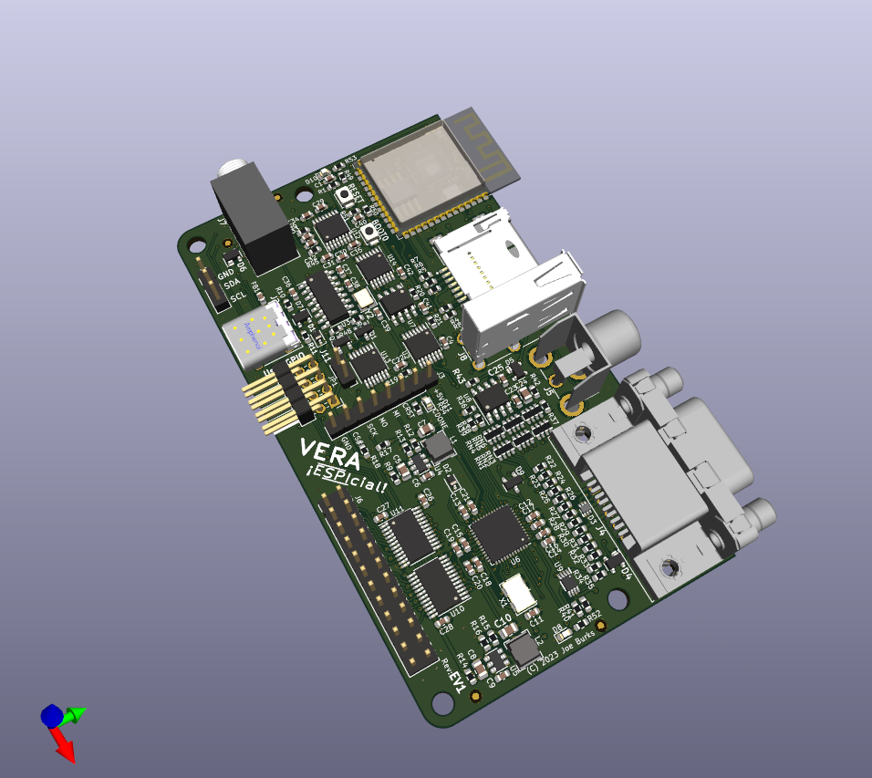

# ESPIcialFW
Firmware for Enhanced VERA with ESP32 and SPI

## Overview

The VERA ESPIcial is the VERA retro video adapter with additional features for makers
and retro enthusiasts to add to their own designs.

Key features of the ESPIcial include:

* Easy WebDAV access to the SD card via WiFi
* OTA capability for the ESP32 firmware via WiFi
* Update via SD card for FPGA
* Backup update interface for ESP32 and FPGA through USB C connector via serial
* Supports all video and audio features of the original VERA
  * 640x480 @60Hz Resolution
  * Video output
    * VGA
	* 15KHz RGB with separate or composite sync ("Arcade" or "Amiga" output mode)
	* 480i NTSC-compatible CVBS Color Composite
	* 480i S-Video (pads for S-Video header on bottom of board)
	* "240p" non-interlaced NTSC compatible video
  * 4092 colors (4 bits per color)
  * Tiled and Bitmap graphics
  * Up to 128 Sprites
  * Audio output
      * Stereo output
      * 16 voice programmable sound generator
      * Stereo PCM digital audio output
* Backwards compatible with original VERA bus interface for 8- or 16-bit Homebrew Retro Computers
* SPI interface for adding video to modern microcontrollers
* Power can be supplied through the USB type C connector or +5V on bus connector
* Can function as its own single-board computer
  * Onboard ESP32-S3-WROOM-1-N4R8 Module 
    * Dual 32-bit Xtensa LX7 Cores at 240 MHz
	* Built-in 2.4GHz 802.11 b/g/n WiFi and Antenna
	* Built-in Bluetooth 5 LE
	* 4MB Flash
	* 8MB RAM
  * USB type A port for keyboard (possibly keyboard + Mouse)
  * 3.5mm line level headphone jack for audio
  * Micro SD storage accessible to ESP32 or FPGA
  * I2C Interface
  * 6 user GPIO pins

## Getting Started

### Firmware Environment

Currently the firmware uses the Arduino IDE with the Espressif ESP32 board plugin.
Once the ESP32 board is added to Arduino, use these settings for building the firmware:

1. Board type set to "ESP32 Arduino"/"ESP32S3 Dev Module"
2. Upload Speed is your choice, I use 921600 which seems to work well
3. Upload Mode "UART0 / Hardware CDC" (this was the default in my installation)
4. CPU Frequency "240MHz (WiFi)" (default)
5. Flash Mode "QIO 80MHz" (default)
6. Flash Size "4MB (32Mb)" (default)

### Building Firmware

Install the following libraries:
  * WiFiMulti_Generic
  * WiFiManager
  * MDNS_Generic
  * ESPAsyncTCP
  * ESPAsyncWebCerver
  * AsyncElegantOTA
Press the checkmark button on the Arduino IDE to build the firmware. This may take a few minutes to complete.

### Connecting the ESPIcial to your WiFi

Make sure the X16 is powered on and USB-C on the ESPIcial is NOT connected!
If no WiFi credentials are configured the ESPIcial will create a temporary AP for 60 seconds namend "X16Connect" and provide a captive portal. There you can select your WiFi AP and enter the password. Be aware that the portal is not encrypted, but the credentials will be, once connected.
If you want to reset credentials or connect to a different network, create a file named "RESETWIFI" in the root folder of the SD card.
At each reset the ESPIcial checks for this file and if found, deletes credentials and creates the temporary AP again for 60 seconds.

### Using WebDAV

Connect your webdav client to http://x16webdav. Mount share via file explorer on Windows 10+ or various options on Linux.
This will give you direct access to the SD card via WiFi. Control of the SD card is shared with the X16. With every request via WebDAV the ESPIcial will get the SD card exclusively for at least 5 seconds. Each request within that time will extend access by 5 seconds. So 5 seconds after the last request control of the SD card is returned to the X16.
While the ESPIcial has control over the SD card the X16 won't see the SD card and any file access will end with a "device not present" error.

### Updating the ESP32 Firmware via OTA

The ESP32 Firmware can be updated via WiFi by connecting to http://x16webdav:8080/update and uploading a sketch in compiled binary form.

### Updating the FPGA Firmware via SD card

You can place a file named VERA.BIN in the root folder of the SD card. At each reset the ESPIcial checks if this file exists and updates the FPGA.
The LED is blinking quickly during this time.

### Updating the ESP32 Firmware via Arduino IDE

The ESP32 Firmware can be updated directly from the Arduino IDE by pressing the "Upload" button.

### Updating the FPGA Firmware via serial

The ESP32 Firmware contains an interface that allows the FPGA bitstream to be updated over
the USB C serial interface. A Python script, `espi_update_fpga.py` is included here to facilitate
this. The script requires PySerial to communicate with the ESP32 firmware.

Obtain a VERA firmware and execute the following:

`python espi_update_fpga.py /dev/ttyS3 ~/vera.bin`

Replace `/dev/ttyS3` with the path to the serial port device on your computer (could be `COMx` on Windows) and replace `~/vera.bin` with the path to the VERA bitstream.
